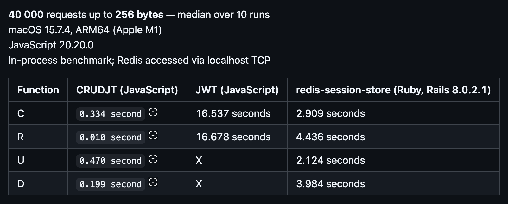

  <picture>
    <source media="(prefers-color-scheme: dark)" srcset="logos/crudjt_logo_white_on_dark.svg">
    <source media="(prefers-color-scheme: light)" srcset="logos/crudjt_logo_dark_on_white.svg">
    
  </picture>
  <b>Fast, file-backed, scalable JSON token engine</b>

CRUDJT is a B-tree–backed persistent token engine for stateful user sessions

It provides:
- predictable disk usage
- low latency across multiple processes
- no external database requirement       

# Getting Started
Install CRUDJT in your language of choice:  
* [Ruby](https://github.com/crudjt/crudjt-ruby): `gem install crudjt --pre`
* [Python](https://github.com/crudjt/crudjt-python): `pip install crudjt`
* [Java](https://github.com/crudjt/crudjt-java): Use JARs from Maven Central Repository
* [JavaScript](https://github.com/crudjt/crudjt-javascript): `npm install crudjt`
* [Elixir](https://github.com/crudjt/crudjt-elixir): `{:crudjt, "~> 1.0.0-beta.0"}`
* [Erlang](https://github.com/crudjt/crudjt_erlang): See repository for usage and integration instructions
* [Go](https://github.com/crudjt/crudjt-go): `go get github.com/crudjt/crudjt-go@latest`
* [PHP](https://github.com/crudjt/crudjt-php): `composer require crudjt/crudjt-php:^1.0@beta`

# Performance one of SDK

[Full benchmark results](https://github.com/crudjt/benchmarks)

## Disk footprint  
**40 000** tokens of **256 bytes** each — median over 10 creates  
darwin23, APFS  

`48 MB`  

[Full disk footprint results](https://github.com/crudjt/disk_footprint)

## Scaling & Deployment

CRUDJT ships with an embedded **gRPC transport layer**, enabling
fast inter-process communication without external brokers

The server is designed for **vertical scaling** with predictable,
file-backed storage and stable latency under load

➡️ Run a production-ready server in seconds using Docker:  
[Docker Server](https://hub.docker.com/r/coffeemainer/crudjt-server)
